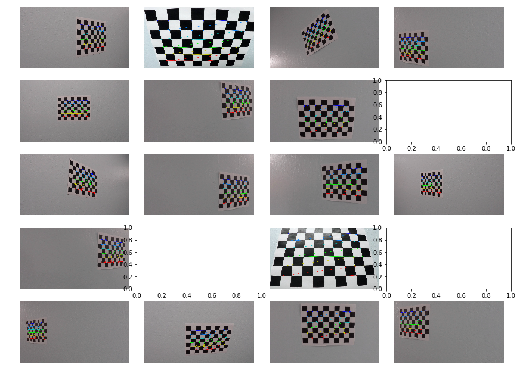
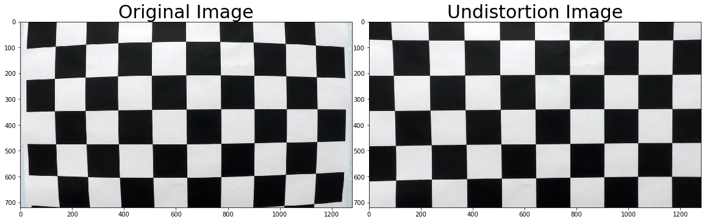
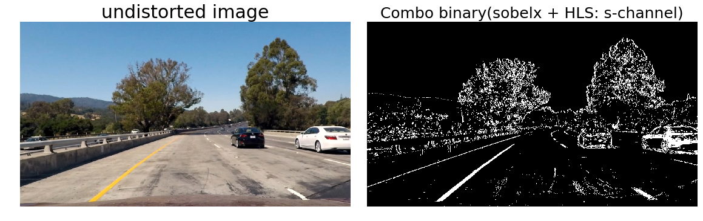
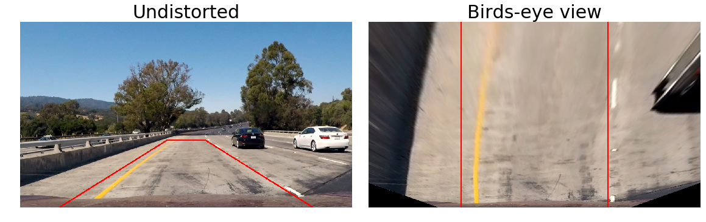
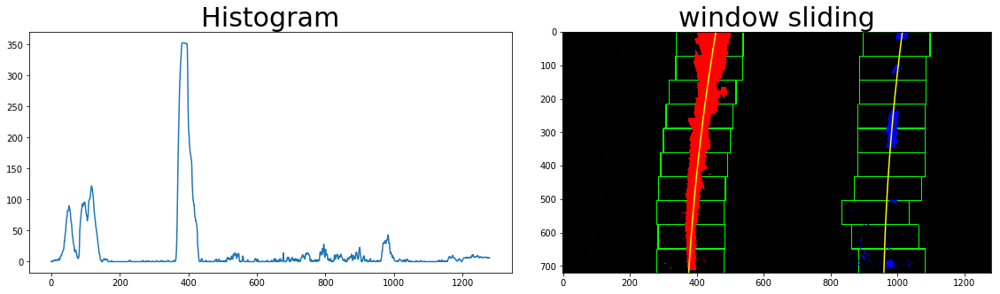
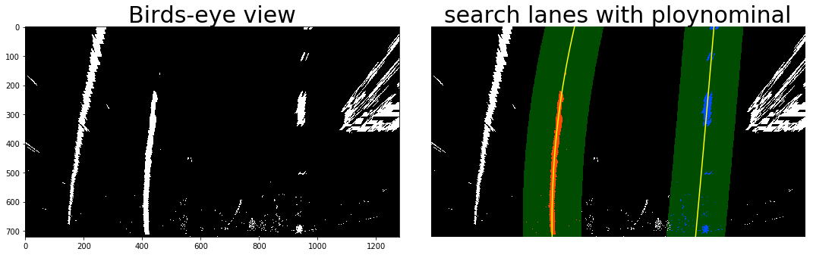
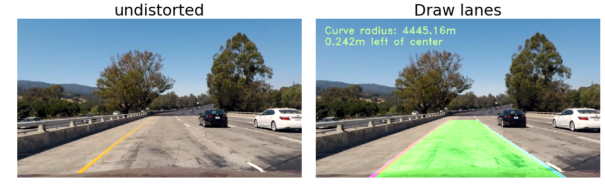
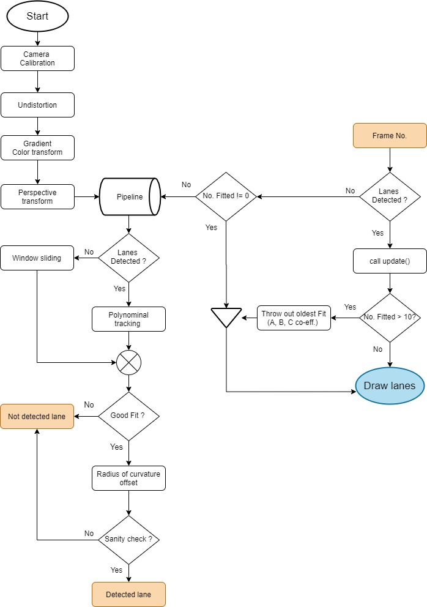

## **Advanced Lanes Detecting**  [Github](git@github.com:JeonghwaLee-TwinDAD/CarND-Advanced-Lane-Detected.git)

---

The goals / steps of this project are the following:

1.  Camera Calibration
2.  Distortion Correction
3.  Perspective Transform
4.  Color and Gradient Threshold
5.  Detect Lane Lines
6.  Determine Lane Curvature
7.  Impose Lane Boundaries on Original Image
8.  Output Visual Display of Lane Boundaries and Numerical Estimation of Lane
9.  Curvature and Vehicle Position


## [Rubric](https://review.udacity.com/#!/rubrics/571/view) Points

*Here I will consider the rubric points individually and describe how I addressed each point in my implementation*

---

### **Camera Calibration**

The code for this step is contained in the first code cell of the IPython notebook located in "./advance_lanes_detect.ipynb"  

I start by preparing "object points", which will be the (x, y, z) coordinates of the chessboard corners in the world. Here I am assuming the chessboard is fixed on the (x, y) plane at z=0, such that the object points are the same for each calibration image.  Thus, `objp` is just a replicated array of coordinates, and `objpoints` will be appended with a copy of it every time I successfully detect all chessboard corners in a test image. `imgpoints` will be appended with the (x, y) pixel position of each of the corners in the image plane with each successful chessboard detection. (**some of these images do not appear because the specified number of chessboard corners were not found**) 

 


Then, I used the output `objpoints` and `imgpoints` to compute the camera calibration and distortion coefficients using the `cv2.calibrateCamera()` function.  I applied this distortion correction to the test image using the `cv2.undistort()` function and obtained this result: 

 

### Pipeline 

#### 1. an example of a distortion-corrected image.
The image below depicts the results of applying undistort to one of the project dashcam images:


#### 2. Describe how (and identify where in your code) you used color transforms, gradients or other methods to create a thresholded binary image. Provide an example of a binary image result.

I used a combination of color(s-channel) and gradient(sobelx) thresholds to generate a binary image Here's an example of my output for this step.



#### 3. Describe how (and identify where in your code) you performed a perspective transform and provide an example of a transformed image.

The code for my perspective transform includes a function called `warper()`, which appears The `warper()` function takes as inputs an image (`img`), as well as source (`src`) and destination (`dst`) points. I chose the hardcode the source and destination points in the following manner:

```python
src = np.float32(
 [[(img.shape[1]-xshift)/2 + offset,img.shape[0]/2 + yshift],
 [(img.shape[1]+xshift)/2 + offset,img.shape[0]/2 + yshift],
 [img.shape[1] - xshift + offset, img.shape[0]],
 [xshift + offset, img.shape[0]]])

dst = np.float32(
 [[(img.shape[1] + xshift) / 4 + offset, 0],
 [(3 * img.shape[1] - xshift) / 4 + offset, 0],
 [(3 * img.shape[1] - xshift) / 4 + offset, img.shape[0]],
 [(img.shape[1] + xshift) / 4 + offset, img.shape[0]]])

xshift = 150 # x shift from 0 at x-axis 
yshift = 100 # y shift from image center 
offset = 10 # trapzoidal box shift to x-direction
```

This resulted in the following source and destination points:

| Source        | Destination   | 
|:-------------:|:-------------:| 
| 565, 460      | 357.5, 0      | 
| 715, 460      | 922.5, 0      |
| 1130, 720     | 922.5, 720    |
| 150, 720      | 357.5, 720    |

I verified that my perspective transform was working as expected by drawing the `src` and `dst` points onto a test image and its warped counterpart to verify that the lines appear parallel in the warped image.



#### 4. Describe how (and identify where in your code) you identified lane-line pixels and fit their positions with a polynomial?

Then I did some other stuff and fit my lane lines with a 2nd order polynomial like this: (Detect lane pixels and fit to find the lane boundary)



 **Skip the sliding window  with polynominal coeffiencts and search function**
 



#### 5. Determine the curvature of the lane and vehicle position with respect to center.
I did this in lines with measure_curvature_real() to find radious of both lines curvature and offset between lane base and vehicle base

#### 6. Provide an example image of your result plotted back down onto the road such that the lane area is identified clearly.

I implemented this step in lines in the `draw_lane()`.  Here is an example of my result on a test image:



---

### Pipeline (video)

#### 1. Provide a link to your final video output.  Your pipeline should perform reasonably well on the entire project video (wobbly lines are ok but no catastrophic failures that would cause the car to drive off the road!).

Here's a [link to my video result](./project_video_out.mp4)

---

### Discussion

 I am thinking about stuey more about the computer vision with free online cource from Georgeia Tech. Lastly, I want to explore the fine tuning for the lane keeping control algorithm more detail later and I hope to revisit some of these strategies in the future.
 Here is the flow chart of this project for Advanced Lanes Detection as below : 
 
 ### *Flow chart for Advanced Lanes Detection*

